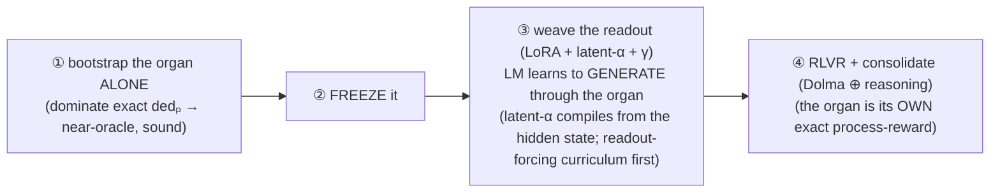

# GLaDOS — Geometric Lattice Deduction Over Streams

**A checked, differentiable deduction organ woven into a language model — and trained to be used.**

GLaDOS welds a sound, abstain-capable reasoning module *inside* a pretrained LLM (OLMo): the model compiles a
problem into the organ, the organ narrows it, and the model reads the result back and answers. The whole thing
is judged by an exact verifier, so the organ is free to be learned and loose while the answer stays honest.

> *New here?* → [`report/glados.pdf`](report/glados.pdf) is the "paper" (stale) · [`GLOSSARY.md`](GLOSSARY.md) the vocabulary ·
> [`CONTRIBUTING.md`](CONTRIBUTING.md) to run it · [`CURSELOG.md`](CURSELOG.md) the honest journey.

## The bet

> A neural module **proposes** (loose, learned, general); reliability comes from a **check at the output**.
> *Soundness is a permission*, not a prescription — we don't prove the organ correct, we check its answer, which
> frees it to be loose and even emergent. *Completeness* — does it reach a checkable answer or honestly abstain —
> is the research variable. The monotone candidate-set lattice is training wheels; the endpoint is a general
> reasoner that stays sound because the boundary checks it.

Grounded in the **Lattice Deduction Transformer** (arXiv 2605.08605) + its Lean proof (soundness is free if
checked; completeness = lattice-level × width), CliffordNet's geometric product (2601.06793), and the
automata-shortcuts result (computation distributes across depth).

## Architecture

```mermaid
flowchart TB
  P["problem (text)"] --> E["host LLM layers 1 … k · FROZEN<br/>(OLMo / Gemma / Qwen / Nemotron-H / SmolLM / Pythia — any residual stream)"]
  E -->|"hidden at k"| A["α · LATENT compile<br/>dense projection: hidden → organ state<br/>(no symbolic extraction)"]
  A --> O["ORGAN BANK · FROZEN (pretrained)<br/>narrow · chain · energy · GF&#40;2&#41; · modular · graph · perm · type · Ising<br/>verifier-gated composition · certified-op + neural-guidance"]
  O --> Y["γ · RICH-STATE readback<br/>partial lattice + confidence · zero-init gate"]
  E -->|"hidden at k"| G(("residual add"))
  Y -. "no-op @ init" .-> G
  G --> L["host LLM layers k+1 … N · FROZEN"]
  L --> H["LM head → answer"]
  H --> V{"exact verifier"}
  V -->|"verifiable reward"| T["train: LoRA + α + γ only"]
  T -. grad .-> A
  T -. grad .-> Y
```

One forward pass up a **frozen** host LLM: at layer *k*, **α latently compiles** the hidden state into the
organ's input — a *dense projection*, **no symbolic extraction**; the **frozen, pretrained organ *bank*** narrows /
derives / optimizes by **verifier-gated composition** — the right faculty for the problem (narrow for CSPs, energy/
Ising for optimization, chain for derivation, GF(2)/modular for affine, …); **γ writes the rich narrowed state**
(the *partial* lattice + confidence, not a cleaned answer — the LM mines what's useful) back through a zero-init
gate; the **LM head generates** from a hidden state saturated with the deduction; an **exact verifier** supplies
the reward. Only **LoRA + α + γ** train — base and organ stay frozen. The coupling is **residual-stream-agnostic**:
proven on 7 bases across Transformer, Mamba-hybrid, and linear-attention architectures.

### Why it's shaped this way

The host and the organ are **two alien computers** — one thinks in token-distributions, the other in
candidate-sets. The hard part is getting them to talk, and the trap is **cold co-training**: optimize α, the
organ, γ, and the LLM all at once and the LLM finds a lazy shortcut (guess from the prompt) *before* the readout
ever forms, then never recruits the organ. The fix is to **stage** it:

Make the organ **good** (pretrained) *and* **necessary** (a task the LLM can't shortcut), freeze it, and the LLM
learns to wield it. The discipline that keeps us honest: a *sound* organ can still be *bypassed*, so **only the
causal controls — shuffle / permute / corrupt the organ and watch accuracy fall — prove the LLM is actually
deducing**, not pattern-matching. (SATNet learned this the hard way; its "learned logic" was label leakage.)

## What we've found (honest — negatives included)

- ⭐ **The staged generative READOUT works.** A learned *general* organ, causally woven into OLMo's generation
  across 7 reasoning types: **woven 98.8% vs base 48% vs text-LoRA 25%** in-distribution; OOD-phrasing 96.3%;
  and **corrupt the organ → generation collapses to 2.7% *with the full problem text still in the prompt*** (the
  LM ignores the text and wields the organ), including hard propagation chains the base model can't shortcut.
  *The staged recipe is demonstrated, not hoped.* OOD-by-size is limited by the *organ's own* recall — not the
  coupling. **Honest scope:** these numbers are **readout-isolation** (the organ is handed the *true* lattice).
  The **real woven model uses LIVE LATENT α** — α compiles the organ's input *from OLMo's hidden state*, no
  symbolic extraction, no ground-truth CSP — and is being wired now (post-codex-preflight). **Readout is proven;
  live-latent-α is the critical path and the honest open piece** (a wrong compile → a confidently wrong organ).
- **The readout coupling is real.** Feed OLMo the *true* lattice through structured γ and its LM head generates
  the right answer, causally (corrupt→0, 100% OOD, ignores redundant text). The earlier "latch gap" was a
  *bandwidth* problem; dense structured γ dissolves it. A *frozen good learned* organ reads as well as the oracle.
- **Cold co-training fails; staging fixes it.** The negative that taught us the recipe — co-trained organs get
  ignored; bootstrap-then-freeze makes them load-bearing.
- **RLVR fixes calibration, not capacity; 7B ≈ 1B; grounding fixes robustness, not exactness.** Each a clean
  result that redirected the next step. The **set-valued readout** makes degradation *graceful and sound* (it
  returns an honest narrowed set, not a confident guess).
- **The 3-organ bank, each with honest limits:** **narrow** (rule-out, sound, abstains) · **chain** (derive
  facts — sound *or* deep, a sharp phase transition) · **energy** (uniquely does *optimization*, ~6% infeasible
  at the affine wall). Recurring signal: **the affine wall (3-way correlation) is the per-cell ceiling for all
  three** — beaten by *depth/width*, and represented by grade-3 structure.
- **Geometric algebra, placed at last.** Null as a generic mixer; its home is the *factor deductor* — grades ↔
  arities (wedge = binary exclusion, trivector = ternary affine), one un-truncated fold for all arities. GA is a
  *completeness/representation* bias, **not** a soundness fix.
- **Novelty is narrow + integrative.** The pieces exist apart — SATNet/DeepProbLog (neural+logic), TransNAR
  (LLM↔reasoner coupling), Coconut (free-form latent superposition-and-elimination = our mechanism, emergent +
  unchecked), RLTT/LSRL (process-reward) — but nobody has woven a *checked, sound* per-problem deductor into a
  pretrained LLM and verifier-trained it. The real edge is the *discipline* (the controls), not the organ alone.

## Where it's going

- **Organ excellence (the bottleneck).** Since OOD tracks the organ's own recall, the highest-leverage work is
  the organ *independently*: full reasoning-gym coverage, a sizing/depth law, factor-generalization to unseen
  relations, and integrating every lesson into one best organ. *(active track)*
- **The reasoning corpus.** A serious, reproducible, HuggingFace-bound dataset — our CSP families + reasoning-gym,
  wide-N, many relation families, *non-shortcutable*, exact-verified, rendered into diverse NL by a strong model.
  The reusable curriculum for both the organ's training *and* teaching the LM to use it. *(active track)*
- **Real RLVR at scale.** The base TRL-GRPO loop runs+learns on one L40S (`rlvr_pipeline.py`); the organ slots in
  by swapping the policy. Two literature-locked requirements: **(1)** test with a **process reward** — outcome-GRPO
  can't credit the organ's internal steps (Ouro/RLTT), and *the organ is itself the exact per-step grader* LSRL
  wanted; **(2)** report **pass@k**, with a ProRL long-RL + random-reward control, on **OLMo** (the honest base).
- **The decisive open question.** Does *ordinary next-token continued-pretraining* exploit the organ
  (→ general architecture) or only targeted RL (→ trick)? Measured by whether next-token loss on reasoning-dense
  text rises when the organ is zeroed. No precedent on a checked deductor. *(active track)*
- **Future bases.** DiffusionGemma — the *iterative marriage* (organ-narrowing ↔ the denoising loop, in lockstep);
  MoE bases — the organ as a *routed expert* (= the bank). OLMo stays the research base (fully-open recipe = honest).

## Layout

- **Ground truth:** `clair/csp.py` (exact solutions, exact `dedₚ`, the general factor lattice, polymorphism
  diagnostic) · `clair/levels.py` (relations × abstraction levels).
- **Verifier ladder:** `curriculum.py` (Bedrock-rendered NL) · `fol.py` (forward-chainer) · `smt.py` (z3 oracle)
  · `schedule.py` (multi-task scheduler) · `datagen/` (the reproducible corpus pipeline).
- **Organ bank:** `proposer.py` (narrow) · `chain_organ.py` (derive) · `energy_organ.py` (optimize) ·
  `blade_deductor.py`/`blade_hi.py` (grade/fold) · `macro_deduct.py` (log-depth) · `run_general.py` (multitask).
- **Woven LLM:** ⭐`run_glados_staged.py` (the working model) · `oracle_readout.py` / `frozen_readout.py` (the
  proven readout + causal controls) · `latent_organ.py` (latent compile) · `rlvr_pipeline.py` (real RLVR) ·
  `glados_woven.py`, `augmented.py`, `gen_augmented.py` (earlier variants).
- **Docs:** `report/glados.{typ,pdf}` (paper) · `CURSELOG.md` (journey) · `notes/` (research: `reading_list`,
  `rlvr_landscape`, `prior_art_extract`, `exploitation_question`, `nesy_lessons`, `future_directions`, …).
- *Parked:* `glados.py`, `ldt.py`, `cliffordnet.py`, `rope_lm.py`, `geom_lm.py`.

## Discipline (learned the hard way)

- Test a method in the regime it targets; never conclude from underpowered or mis-aimed runs.
- The soundness proof is a *permission*, not a prescription — be loose, check the output.
- A classification-readout head is *not* the LM reasoning; the capability test is generative + retrained.
- Don't cold-co-train alien computers — **stage** it; make the organ good *and* necessary.
- A *sound* organ can still be *bypassed* — only the causal controls prove deduction. Report pass@k, not just pass@1.
- Run a portfolio; let the data, not the enthusiasm, pick the next bet. **Negatives are results.**
