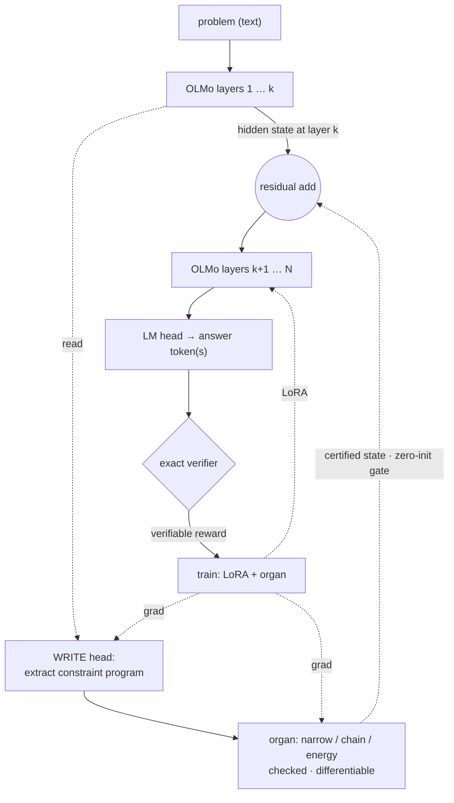

# GLaDOS — Geometric Lattice Deduction Over Streams

A research program toward a **hybrid deductive language model**: a learned, differentiable, *checked*
reasoning organ woven into an LLM's forward pass, trained on a ladder of exactly-verifiable tasks.

> **The spine.** A neural module PROPOSES (loose, learned, general); reliability comes from a check AT THE
> OUTPUT — soundness is a *permission* to make the organ loose, not a prescription to make it a verifier.
> COMPLETENESS (does it reach a checkable answer vs honestly abstain) is the research variable. The lattice
> (monotone candidate-set narrowing) is the training-wheels inductive bias; the endpoint is a general,
> *emergent* reasoner that stays sound because the boundary checks it.

Grounded in: the Lattice Deduction Transformer (arXiv 2605.08605) + its **Lean** formalization (soundness is
free if checked; completeness = lattice-level × problem-width — *proven*); CliffordNet's geometric product
(2601.06793); the automata-shortcuts paper (computation distributes across depth). See `notes/`.

## Architecture (target)

Read it as one forward pass up the layer stack: OLMo runs layers `1…k`; at layer `k` the **WRITE head**
reads the hidden state and compiles a constraint program; the **organ** narrows/derives it (checked,
differentiable); its certified state is **added back into the same hidden state** through a zero-init gate
(so it's a no-op until trained); OLMo runs the remaining layers `k+1…N` on that modified state and its
**LM head generates the answer token(s)**; an **exact verifier** checks the output and feeds the
**verifiable reward** that trains the organ + LoRA. Solid arrows = the forward pass; dotted = the organ's
read / write-back / gradients. *(Today's code is the terminal-readout subset; woven + generative +
multi-organ are the live tracks.)*

## What we've found (honest)
- **The (d) bet works**: a frozen LLM + a checked deductor gains calibrated abstention it otherwise lacks
  (augmented det-acc 88.8% vs base OLMo 1.4%). **RLVR** (GRPO on the *exact* verifiable reward) fixes
  *calibration* (+18-20 abstain-recall OOD), not capacity.
- **Capacity isn't the wall**: OLMo-3-7B ≈ 1B on extraction. **Grounding** the WRITE head fixes extraction
  *robustness* (survives diverse phrasing 6→43, OOD 14→65) but not *exactness*. The deeper wall was the
  deductor's brittleness → the **set-valued readout** makes degradation graceful + sound (useful-info ~flat
  66% OOD where singleton-acc collapses; a bad edge widens the set instead of flipping the answer).
- **Geometric product as a generic mixer = null** (ties SwiGLU/MLP). Its real home is the *factor deductor*:
  geometric-product GRADES ↔ lattice abstraction LEVELS (wedge = binary exclusion, trivector = the ternary
  affine structure that breaks the per-cell wall). Structure-matched, not decorative.
- **Honest gap (verified in code)**: in the classification-readout setup the organ has ZERO causal influence
  on OLMo (frozen + detached + terminal). The *real* test is generative — the answer emitted by OLMo's LM
  head, organ woven in, LoRA-retrained, with a causal ablation that bites.

## Current tracks (live)
- **Capability** — generative woven+LoRA: does OLMo's *token selection* use the organ? (ablation: zero the
  organ at generation, does output degrade?) `clair/gen_augmented.py`.
- **Generality** — one *general* factor-graph deductor (any constraint type, grade-structured interactions),
  trained multi-task across the verifier ladder; held-out-constraint-type zero-shot.
- **The organ bank** — the three inference SHAPES as checked differentiable organs: **narrowing** (have),
  **forward-chaining** (derive facts, the dual; grounded by `fol.py`), **energy/equilibrium** (soft +
  optimization; next). Plus **memory** = the shared blackboard the organs compose through + a cumulative,
  sound, retrievable **library of verified reasoning fragments**. Long arc: the LM routes over the bank.

## Layout
- `clair/csp.py` — exact CSP harness (ground truth): solutions, exact `dedₚ`, per-cell AC, **general factor
  lattice (any arity)**, polymorphism diagnostic. `clair/levels.py` — relations × abstraction levels.
- `clair/curriculum.py` (+ Bedrock diverse NL), `clair/fol.py` (forward-chainer, entail/contradict/unknown),
  `clair/smt.py` (z3 oracle), `clair/schedule.py` (multi-task curriculum scheduler) — the verifier ladder.
- `clair/augmented.py` / `rlvr_augmented.py` — the woven LLM organ + RLVR. `clair/proposer.py` — factor-graph
  proposer. `clair/gen_augmented.py` — generative test.
- `notes/` — `papers.md`, `prior_art.md`, `future_directions.md` (the organ-bank roadmap), `codex_review_handoff.md`.
- parked/superseded: `glados.py`, `ldt.py`, `cliffordnet.py`, `rope_lm.py`, `geom_lm.py`, `model.py` (see commits + notes).

## Discipline (learned the hard way)
- Test a method in the regime it targets; don't conclude from underpowered/mis-aimed runs.
- The soundness proof is a permission (be loose, check the output), not a prescription.
- A classification-readout head is *not* the LM reasoning — the capability test is generative + retrained.
- Run a portfolio across boxes; let the data, not the enthusiasm, pick the next bet.
