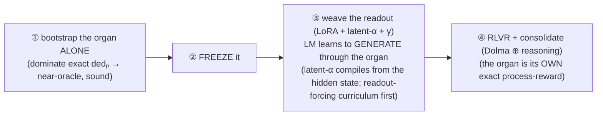

# GLaDOS — Geometric Lattice Deduction Over Streams

**A checked, differentiable deduction organ woven into a language model — and trained to be used.**

GLaDOS welds a sound, abstain-capable reasoning module *inside* a pretrained LLM (OLMo): the model compiles a
problem into the organ, the organ narrows it, and the model reads the result back and answers. The whole thing
is judged by an exact verifier, so the organ is free to be learned and loose while the answer stays honest.

> *New here?* → [`GLADOS.md`](GLADOS.md) is the engineering front-door · [`report/glados.pdf`](report/glados.pdf) the "paper" ·
> [`GLOSSARY.md`](GLOSSARY.md) the vocabulary · [`CONTRIBUTING.md`](CONTRIBUTING.md) to run it · [`CURSELOG.md`](CURSELOG.md) the honest journey.

## The bet

> A neural module **proposes** (loose, learned, general); reliability comes from a **check at the output**.
> *Soundness is a permission*, not a prescription — we don't prove the organ correct, we check its answer, which
> frees it to be loose and even emergent. *Completeness* — does it reach a checkable answer or honestly abstain —
> is the research variable. The monotone candidate-set lattice is training wheels; the endpoint is a general
> reasoner that stays sound because the boundary checks it.

Grounded in the **Lattice Deduction Transformer** (arXiv 2605.08605) + its Lean proof (soundness is free if
checked; completeness = lattice-level × width), CliffordNet's geometric product (2601.06793), and the
automata-shortcuts result (computation distributes across depth).

## Architecture

```mermaid
flowchart TB
  P["problem (text)"] --> E["host LLM layers 1 … k · FROZEN<br/>(OLMo / Gemma / Qwen / Nemotron-H / SmolLM / Pythia — any residual stream)"]
  E -->|"hidden at k"| A["α · LATENT compile<br/>dense projection: hidden → organ state<br/>(no symbolic extraction)"]
  A --> O["ORGAN BANK · FROZEN (pretrained)<br/>narrow · chain · energy · GF&#40;2&#41; · modular · graph · perm · type · Ising<br/>verifier-gated composition · certified-op + neural-guidance"]
  O --> Y["γ · RICH-STATE readback<br/>partial lattice + confidence · zero-init gate"]
  E -->|"hidden at k"| G(("residual add"))
  Y -. "no-op @ init" .-> G
  G --> L["host LLM layers k+1 … N · FROZEN"]
  L --> H["LM head → answer"]
  H --> V{"exact verifier"}
  V -->|"verifiable reward"| T["train: LoRA + α + γ only"]
  T -. grad .-> A
  T -. grad .-> Y
```

One forward pass up a **frozen** host LLM: at layer *k*, **α latently compiles** the hidden state into the
organ's input — a *dense projection*, **no symbolic extraction**; the **frozen, pretrained organ *bank*** narrows /
derives / optimizes by **verifier-gated composition** — the right faculty for the problem (narrow for CSPs, energy/
Ising for optimization, chain for derivation, GF(2)/modular for affine, …); **γ writes the rich narrowed state**
(the *partial* lattice + confidence, not a cleaned answer — the LM mines what's useful) back through a zero-init
gate; the **LM head generates** from a hidden state saturated with the deduction; an **exact verifier** supplies
the reward. Only **LoRA + α + γ** train — base and organ stay frozen. The coupling is **residual-stream-agnostic**:
proven on 7 bases across Transformer, Mamba-hybrid, and linear-attention architectures.

### Why it's shaped this way

The host and the organ are **two alien computers** — one thinks in token-distributions, the other in
candidate-sets. The hard part is getting them to talk, and the trap is **cold co-training**: optimize α, the
organ, γ, and the LLM all at once and the LLM finds a lazy shortcut (guess from the prompt) *before* the readout
ever forms, then never recruits the organ. The fix is to **stage** it:

Make the organ **good** (pretrained) *and* **necessary** (a task the LLM can't shortcut), freeze it, and the LLM
learns to wield it. The discipline that keeps us honest: a *sound* organ can still be *bypassed*, so **only the
causal controls — shuffle / permute / corrupt the organ and watch accuracy fall — prove the LLM is actually
deducing**, not pattern-matching. (SATNet learned this the hard way; its "learned logic" was label leakage.)

## What we've found (honest — CURRENT, negatives included)

The overhaul cleared all six known blockers: the live woven model is no longer a stopgap single-faculty
narrower — **it is the real consolidated organ**, and everything below is measured on *that* artifact
(`clair/organ/bank_woven.py`).

- ⭐ **The consolidated woven organ ENGAGES.** α latently compiles the host hidden state into a per-cell
  candidate lattice; a **composer** runs the **certified floor** (Arc / Factor / Modular-SNF / GF(2) row-space /
  Macro-reach) + the *pretrained* neural narrower + α's own compile, **all verifier-gated**; γ reads the
  **composed** lattice into the residual stream. It is causally load-bearing: **corrupt the lattice →
  generation drops ~+97 pts** (true ~100% → corrupt ~0.3%), **lift +77** over no-organ, **no-op@init bitwise
  0.0**, **false-elim 0** vs the exact verifier. The engagement levers are the **two-stream** input asymmetry
  (α reads the full text; the LM generates from a *fact-ablated cells prompt*, so the organ is the only route)
  + **J0 direct α-supervision** (dominate-dedₚ on α's raw compile — the SATNet grounding fix). *(The earlier
  "gate stays shut, drop = 0" was a step-count under-training artifact, resolved.)*
- **The certified FLOOR makes it miscompile-robust BY CONSTRUCTION.** The certified ops run from the full
  domain; the meet of sound narrowings is sound, and the neural/α proposals can only sharpen *toward* the exact
  per-cell transformer, never below it — so a confidently-wrong α-compile **cannot poison** the injected state.
  This **subsumes the old "train-for-robustness" calibration story**: robustness is now structural, not a
  curriculum trick.
- **Solve-by-reduction generalizes (the reduction graph).** `organ/reductions.py` is a typed *cross-type*
  `ProblemReduction` graph (MIS↔VC↔clique · 3-SAT/2-SAT/XOR-SAT→CSP · 3-SAT→MIS→Ising · {MIS,MaxCut,partition,
  coloring}→Ising), every edge **exact-verified end-to-end against X's own solver**, Dijkstra cost-routed with a
  certified-over-approx tie-break. Smoke on the real bank-woven: a **route-required** family with *no direct
  faculty* (XOR-SAT) is solved **100% via the reduction** (lift +47.5), **held-out reduction-paths 100%**
  (lift +37.5), base-with-LoRA-off 0% (the answer exists only through the reduced+solved lattice). One faculty
  + edges = everything Karp-reducible to it — the generality multiplier.
- **The organ is LEGIBLE — learned-free.** A probe with **no trained decoder anywhere** reads α's compile by
  *direct set-comparison* to the exact dedₚ: overall **F1 0.90, recall 0.98** (rarely misses a true constraint;
  precision 0.82), per-rung alldiff 0.97 > coloring 0.90 > arithmetic 0.89 > equality 0.86 > ordering 0.85;
  candidate-set recovery 0.93–1.0 across cardinalities; **reaches a singleton on the query 100%**. The
  composer's reduced-product trace is legible by construction (which faculty fired, which neural proposals were
  gated). We can read **what the organ posed and what it concluded** — the interp advantage over a dense bypass
  is real. (`runs/interp_bank.json`, n = 300.)
- **7/7 model-graft, residual-stream-agnostic.** `organ/graft.py` splices the organ into any of 7 bases across
  3 architecture families — Pythia-160M, OLMo-2-1B, SmolLM3-3B, Gemma-4-12B, Qwen-3.6-27B (linear-attn hybrid),
  **Nemotron-H-8B (Mamba-2 SSM hybrid)**, OLMo-3-32B (QLoRA 4-bit) — each **bitwise no-op@init** +
  gate-open-moves-logits. The Nemotron-H datapoint is decisive: the inject point is *on a Mamba-2 block* and the
  edit is still clean, because every block boundary is a plain residual add regardless of mixer.
- **Rust hot-path: 29–56× CPU wall, bitwise-identical.** `clair_fast/` (PyO3 + rayon) ports the exact-dedₚ /
  solutions / AC data path; **13,590 comparisons, 0 mismatches** vs pure-Python. The CPU dedₚ ground-truth path
  (not the GPU) was the pretrain bottleneck; this unblocks the real organ-pretrain at the dⁿ-explosion budgets.
  (`CLAIR_NO_FAST=1` forces the pure-Python path.)
- **The still-true earlier findings (kept).** The **staged recipe** is the spine — organ-pretrain → *freeze* →
  weave → RLVR; *cold co-training fails, staging fixes it*. Next-token continued-pretraining **recruits** the
  organ with no reward (exploitation = architecture, not RLVR trick); **split-brain** shows the LM *wields* it
  under adversarial text. RLVR fixes *calibration*, not capacity; 7B ≈ 1B on the coupling; grounding fixes
  *robustness*, not exactness; the **rich-state set-valued readout** makes degradation graceful and sound. The
  **affine wall** is real at bounded width — single ternary constraints need grade-3, XOR *systems* need the
  certified GF(2) row-space organ; neither is beaten by depth alone.

> **Honest scope — the open frontier.** Everything above is measured in the **easy regime**, where the problem's
> *true* constraint structure is handed to the composer. There the **certified floor carries answer-correctness
> on its own** — the interp probe shows answer-acc 1.0 whether or not α's compile is faithful, with
> corr(faithful, correct) = 0 *because there is no variance to correlate*. So the bottleneck test — *does
> α-from-hidden DRIVE correctness?* — is **saturated / inconclusive** in this regime. The genuinely open piece is
> **α-on-real-NL**: α compiling the constraints from natural-language text with **no provided structure**, where
> correctness drops and failures become attributable (the `eval_real_nl` hook is wired). **Proven:** legible,
> engages, certified-floor-robust, reduction-generalizes, 7/7 graft, Rust. **Open:** α-from-real-text *driving*
> correctness — the bottleneck test needs the harder regime.

## Where it's going

- **Datagen at corpus scale.** `clair/datagen/` (build · render · skins · qc · parse · trace · verify_fast ·
  compose_csp) **+ the reduction curriculum** (`datagen/reductions.py`: recognize · reduce-X→Y · solve-via-Y ·
  decode, with BLEND = multi-representation per base and CANONICALIZE for dedup/verify — 320 surfaces → 160
  canonical keys, two OOD splits). One reusable, exact-verified corpus for both organ-pretrain *and* teaching
  the LM to wield it. *(prep track)*
- **The now-fast organ-pretrain → the woven matrix.** With the Rust path unblocking dⁿ-explosion budgets,
  pretrain the general organ at scale, then run the woven readout across the **7-base matrix** through the
  `eval_suite` arbiter (Tier-1 CSP + causal controls + reasoning-gym ceiling; Tier-2 transfer; Tier-3 no-harm;
  pass@1 **and** pass@k). *(active track)*
- **The α-on-real-NL frontier** — the open bottleneck above: the one test the easy regime structurally cannot
  deliver. Highest-leverage next experiment.
- **Abstract-machine faculties — parked-but-mapped.** Two more `Reduction`s are designed against the spine
  (`notes/abstract_machines.md`): a **PTIME-Datalog** organ (extend the certified `unification_chain` + a
  verifier-gated rule-proposer — cheapest, the certified floor already exists) and a **∂4-Forth procedural**
  organ (output-checked, brittle, scoped to checkable iterative tasks — build second); full lambda/RISC parked.

## Layout

- **`clair/organ/` — the canonical pipeline.** `protocol.py` (the typed spine: Reduction / CSPState /
  Certificate + the structured-γ readout) · `bank.py` (the registry of validated beasts as reductions: certified
  Arc/Factor/Modular/GF2/Macro/Unification + approximate Energy + verifier-gated neural CoreNarrowOrgan/Blade) ·
  `compose.py` (verifier-gated reduced product) · ⭐`bank_woven.py` (**the real woven model**: α → composer → γ) ·
  `graft.py` (the model-agnostic 7-base neural-graft) · `reductions.py` (the cross-type reduction graph) ·
  `train.py` (`pretrain → weave → rlvr`) · `eval.py` (arbiter) · `selftest.py` (CPU smoke).
- **`clair_fast/` — the Rust hot path** (PyO3 + rayon: exact-dedₚ / solutions / AC; `clair/csp.py` dispatches to
  it when importable, pure-Python fallback verified bitwise-identical).
- **`clair/eval_suite.py` — the external arbiter** (Tier-1/2/3 + causal controls + pass@k; base-agnostic
  checkpoint I/O, judge any woven deltas on any HF base).
- **Ground truth & corpus:** `clair/csp.py` (exact finite-CSP harness + the verifier `exact_dedP`) ·
  `clair/levels.py` (relation × abstraction-level map) · `clair/datagen/` (the reproducible corpus + reduction
  curriculum) · the per-beast organ files (`proposer`, `blade_deductor`, `modular`, `xor_wall`, `macro_deduct`,
  `fol`, `ising_organ`, …) wired into `organ/bank.py`.
- **Interp:** `clair/interp_probe_bank.py` (the learned-free probe) → `runs/interp_bank.json`.
- **Docs:** [`GLADOS.md`](GLADOS.md) the engineering front-door · [`clair/MANIFEST.md`](clair/MANIFEST.md) the
  file map · `report/glados.{typ,pdf}` the paper · `notes/` (`training`, `readout_forcing`, `abstract_machines`,
  `organ_excellence`, `future_directions`, …) · `CURSELOG.md` the journey.
- *Parked / quarantined:* `clair/_graveyard/` (superseded woven variants + the pre-pivot Sudoku monolith + the
  parked GA/LM prototypes) — nothing in the live tree imports it; see MANIFEST.

## Discipline (learned the hard way)

- Test a method in the regime it targets; never conclude from underpowered or mis-aimed runs.
- The soundness proof is a *permission*, not a prescription — be loose, check the output.
- A classification-readout head is *not* the LM reasoning; the capability test is generative + retrained.
- Don't cold-co-train alien computers — **stage** it; make the organ good *and* necessary.
- A *sound* organ can still be *bypassed* — only the causal controls prove deduction. Report pass@k, not just pass@1.
- Run a portfolio; let the data, not the enthusiasm, pick the next bet. **Negatives are results.**
