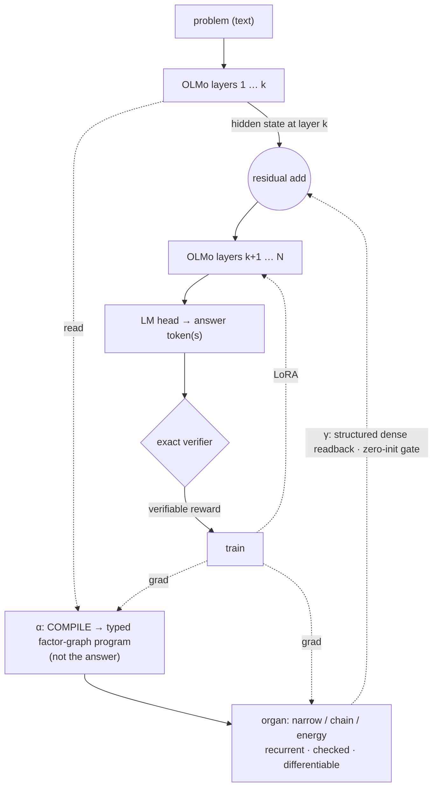

# GLaDOS — Geometric Lattice Deduction Over Streams

A research program toward a **hybrid deductive language model**: a learned, differentiable, *checked*
reasoning organ woven into an LLM's forward pass, trained on a ladder of exactly-verifiable tasks.

New here? → [`GLOSSARY.md`](GLOSSARY.md) for the vocabulary, [`CONTRIBUTING.md`](CONTRIBUTING.md) to run/extend it.

> **The spine.** A neural module PROPOSES (loose, learned, general); reliability comes from a check AT THE
> OUTPUT — soundness is a *permission* to make the organ loose, not a prescription to make it a verifier.
> COMPLETENESS (does it reach a checkable answer vs honestly abstain) is the research variable. The lattice
> (monotone candidate-set narrowing) is the training-wheels inductive bias; the endpoint is a general,
> *emergent* reasoner that stays sound because the boundary checks it.

Grounded in: the Lattice Deduction Transformer (arXiv 2605.08605) + its **Lean** formalization (soundness is
free if checked; completeness = lattice-level × problem-width — *proven*); CliffordNet's geometric product
(2601.06793); the automata-shortcuts paper (computation distributes across depth). See `notes/`.

## Architecture (target — the "D" weave)

One forward pass up the layer stack: at layer `k`, **α compiles** OLMo's hidden state into a *typed
factor-graph program* (variables, domains, factors — **not** a pre-solved answer); the **organ** narrows it
*recurrently, between layers* (no backprop through repeated OLMo passes); **γ** writes the certified state
*densely and structurally* back into the residual stream through a zero-init gate; OLMo's **LM head
generates** the answer from a hidden state saturated by the deduction; an **exact verifier** supplies the
reward. The same α/γ pattern hosts the whole organ bank.

## What we've found (honest)
- **The checked-deductor bet works**: a frozen LLM + a checked deductor gains calibrated abstention it
  otherwise lacks (det-acc 88.8% vs base 1.4%). **RLVR** fixes *calibration* (+18-20 abstain-recall OOD), not capacity.
- **The dense readout WORKS** (oracle de-risk, decisive): feed OLMo the *true* narrowed lattice through
  structured γ and its **LM head generates the right answer, causally** — shuffle/permute/**corrupt→0** even
  with the full problem in the prompt (it ignores the text, reads the lattice), 100% OOD. *The latch gap was a
  bandwidth problem, and structured dense-γ solves it.*
- **But cold co-training FAILS** (woven model): a *learned* organ co-trained from scratch is *ignored* — the LM
  shortcuts via prompt-text + an abstain prior; causal controls flat. **Diagnosis:** two alien substrates
  (token-distribution LM ↔ candidate-set deductor), both bad at the start, can't bootstrap each other.
- **The 3-organ bank exists** and each is validated with honest limits: **narrow** (rule-out, sound, abstains),
  **chain** (derive facts; sound *or* deep, a sharp phase transition), **energy** (solves + uniquely does
  *optimization*, 85.5% exact min-cost; ~6% infeasible at the affine wall). A recurring signal: **the affine
  wall (3-way/arithmetic correlation) is the level-0 ceiling for all three** — where factor/grade-3 structure must earn its keep.
- **Geometric product as a generic mixer = null**; its real home is the *factor deductor* (grades ↔ arities:
  wedge = binary exclusion, trivector = ternary affine). GA is a *completeness/representation* bias, **not** a soundness fix.

## The training recipe — STAGED, not end-to-end
The central lesson: **don't cold-co-train the LM and the organ.** Decouple.
1. **Organs → excellence, separately.** Train the deductors hard on many tasks (the verifier ladder & beyond)
   until they're general, robust, near-oracle — *standalone reasoners, no LM*. (Cheap — pure organ.)
2. **Pretrain each interface piece on its own sub-task.** γ on oracle-lattice→answer readout (*proven*); α on
   text→program extraction (supervised). Each translator competent before it has to cooperate.
3. **Assemble pretrained pieces, then CONSOLIDATE.** Plug them together and only then do the long, weird
   training where the LM learns to *route its reasoning through the organ* — closer to re-running real
   training (Dolma-recipe-with-the-organ) so organ-use becomes *native*, not bolted-on.
The organ becomes load-bearing only when it is both **good** (pretrained) and **necessary** (the task can't be
shortcut). Live experiments are probing exactly these joints.

## Layout
- `clair/csp.py` — exact CSP harness (ground truth): solutions, exact `dedₚ`, per-cell AC, **general factor
  lattice (any arity)**, polymorphism diagnostic. `clair/levels.py` — relations × abstraction levels.
- **Verifier ladder**: `curriculum.py` (+ Bedrock diverse NL), `fol.py` (forward-chainer, entail/contradict/unknown),
  `smt.py` (z3 oracle), `schedule.py` (multi-task scheduler).
- **Organ bank**: `proposer.py` (narrow) · `chain_organ.py` (derive) · `energy_organ.py` (optimize) · `run_general.py` (multitask narrow).
- **Woven LLM**: `augmented.py` + `rlvr_augmented.py` (terminal-readout + RLVR) · `oracle_readout.py` (the proven
  dense-γ readout + causal controls) · `glados_woven.py` (the corrected-D woven model) · `gen_augmented.py` (generative).
- `notes/` — `papers.md`, `prior_art.md`, `future_directions.md` (organ-bank roadmap), `codex_arch_review.md`, `codex_review_handoff.md`.
- parked/superseded: `glados.py`, `ldt.py`, `cliffordnet.py`, `rope_lm.py`, `geom_lm.py`, `model.py`.

## Discipline (learned the hard way)
- Test a method in the regime it targets; don't conclude from underpowered/mis-aimed runs.
- The soundness proof is a *permission* (be loose, check the output), not a prescription.
- A classification-readout head is *not* the LM reasoning — the capability test is generative + retrained.
- Don't cold-co-train alien substrates; stage the training. Make the organ good *and* necessary.
- Run a portfolio across boxes; let the data, not the enthusiasm, pick the next bet. Report honest nulls.
