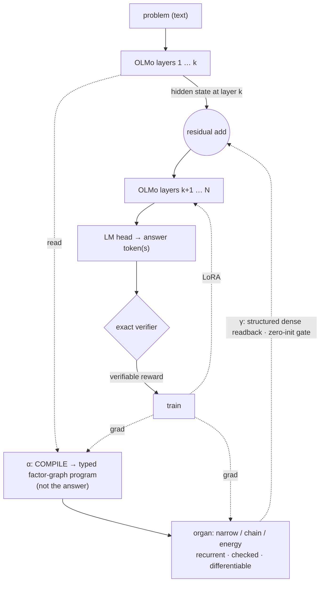
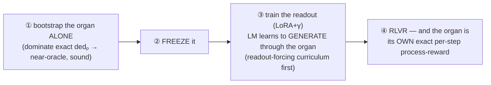

# GLaDOS — Geometric Lattice Deduction Over Streams

A research program toward a **hybrid deductive language model**: a learned, differentiable, *checked*
reasoning organ woven into an LLM's forward pass, trained on a ladder of exactly-verifiable tasks.

New here? → [`GLOSSARY.md`](GLOSSARY.md) for the vocabulary, [`CONTRIBUTING.md`](CONTRIBUTING.md) to run/extend it.

> **The spine.** A neural module PROPOSES (loose, learned, general); reliability comes from a check AT THE
> OUTPUT — soundness is a *permission* to make the organ loose, not a prescription to make it a verifier.
> COMPLETENESS (does it reach a checkable answer vs honestly abstain) is the research variable. The lattice
> (monotone candidate-set narrowing) is the training-wheels inductive bias; the endpoint is a general,
> *emergent* reasoner that stays sound because the boundary checks it.

Grounded in: the Lattice Deduction Transformer (arXiv 2605.08605) + its **Lean** formalization (soundness is
free if checked; completeness = lattice-level × problem-width — *proven*); CliffordNet's geometric product
(2601.06793); the automata-shortcuts paper (computation distributes across depth). See `notes/`.

## Architecture (target — the "D" weave)

One forward pass up the layer stack: at layer `k`, **α compiles** OLMo's hidden state into a *typed
factor-graph program* (variables, domains, factors — **not** a pre-solved answer); the **organ** narrows it
*recurrently, between layers* (no backprop through repeated OLMo passes); **γ** writes the certified state
*densely and structurally* back into the residual stream through a zero-init gate; OLMo's **LM head
generates** the answer from a hidden state saturated by the deduction; an **exact verifier** supplies the
reward. The same α/γ pattern hosts the whole organ bank.

### The intuition (why it's shaped this way)
The host LLM and the deductor are **two alien computers**: one thinks in token-distributions, the other in
candidate-sets-per-cell. The hard part isn't building either — it's getting them to *talk*. Two principles
make it work:
- **Soundness is a *permission*, not a prescription.** The output is checked by an exact verifier, so the
  organ is *free* to be loose, learned, even emergent — the check at the boundary catches it. We don't have
  to *prove* the organ correct; we *check* its answer.
- **Don't cold-co-train alien computers.** If you train α, the organ, γ, and the LLM all at once, the LLM finds
  a lazy shortcut (guess from the prompt text) *before* the organ-readout ever forms, and never recruits it.
  The fix is to **stage** it:

Make the organ **good** (pretrained) *and* **necessary** (a task the LLM can't shortcut), freeze it, and the
LLM learns to wield it — even with the answer-text sitting right there in the prompt. That's not a hope; it's
the demonstrated result below (corrupt the frozen organ's lattice → generation collapses to ~3% *with full
text present*). The single discipline that keeps us honest: a *sound* organ can still be *bypassed*, so
**only the causal controls** — shuffle / permute / corrupt the organ and watch accuracy fall — prove the LLM
is *actually* deducing rather than pattern-matching (the lesson SATNet learned the hard way).

## What we've found (honest)
- **The checked-deductor bet works**: a frozen LLM + a checked deductor gains calibrated abstention it
  otherwise lacks (det-acc 88.8% vs base 1.4%). **RLVR** fixes *calibration* (+18-20 abstain-recall OOD), not capacity.
- **The dense readout WORKS** (oracle de-risk, decisive): feed OLMo the *true* narrowed lattice through
  structured γ and its **LM head generates the right answer, causally** — shuffle/permute/**corrupt→0** even
  with the full problem in the prompt (it ignores the text, reads the lattice), 100% OOD. *The latch gap was a
  bandwidth problem, and structured dense-γ solves it.*
- **Cold co-training FAILS — but STAGING fixes it, and the assembled model WORKS.** A *learned* organ
  co-trained from scratch is *ignored* (LM shortcuts via prompt-text + abstain prior). The fix isn't denying
  the text — it's **bootstrap → FREEZE the organ → train the readout**. ⭐ **The staged generative GLaDOS: a
  learned *general* organ causally woven into OLMo's generation across 7 reasoning types — woven 98.8% vs base
  48% vs text-LoRA 25% in-dist; OOD-phrasing 96.3%; corrupt→2.7% *with the full problem text present* (the LM
  ignores the text and wields the organ), including hard propagation chains base/text-LoRA cannot shortcut.**
  OOD-N is limited by the *organ's own* recall, not the readout. *The staged recipe is demonstrated, not hoped.*
- **Novelty is narrow + integrative; the real edge is *discipline*.** No system holds all of {woven · dense
  differentiable readback · output-checked/sound · per-problem compiled program · verifier-trained} — GLaDOS is
  the first to weave a *checked* per-problem deductor into an LLM and verifier-train it. But the **SATNet
  cautionary tale** (its "learned logic" was label-leakage; "reasoning shortcuts are loss optima," Marconato
  2023) means the organ being *sound* doesn't prevent the LM *bypassing* it — **only the causal controls
  (shuffle/permute/corrupt) prove genuine deduction.** That discipline, run on every result, is the edge.
- **The 3-organ bank exists** and each is validated with honest limits: **narrow** (rule-out, sound, abstains),
  **chain** (derive facts; sound *or* deep, a sharp phase transition), **energy** (solves + uniquely does
  *optimization*, 85.5% exact min-cost; ~6% infeasible at the affine wall). A recurring signal: **the affine
  wall (3-way/arithmetic correlation) is the level-0 ceiling for all three** — where factor/grade-3 structure must earn its keep.
- **Geometric product as a generic mixer = null**; its real home is the *factor deductor* (grades ↔ arities:
  wedge = binary exclusion, trivector = ternary affine). GA is a *completeness/representation* bias, **not** a soundness fix.

## The training recipe — STAGED, not end-to-end
The central lesson: **don't cold-co-train the LM and the organ.** Decouple.
1. **Organs → excellence, separately.** Train the deductors hard on many tasks (the verifier ladder & beyond)
   until they're general, robust, near-oracle — *standalone reasoners, no LM*. (Cheap — pure organ.)
2. **Pretrain each interface piece on its own sub-task.** γ on oracle-lattice→answer readout (*proven*); α on
   text→program extraction (supervised). Each translator competent before it has to cooperate.
3. **Assemble pretrained pieces, then CONSOLIDATE.** Plug them together and only then do the long, weird
   training where the LM learns to *route its reasoning through the organ* — closer to re-running real
   training (Dolma-recipe-with-the-organ) so organ-use becomes *native*, not bolted-on.
The organ becomes load-bearing only when it is both **good** (pretrained) and **necessary** (the task can't be
shortcut) — *demonstrated* by the staged generative GLaDOS above.

## Where it's going — real RLVR at scale
The toy is built; it's profoundly *undertrained* (1B, synthetic CSPs). Next is **RLVR on standardized verifiable
reasoning** (reasoning-gym / ZebraLogic / SAT / math) with the organ as a *tested* component. The base TRL-GRPO
loop already runs+learns on one L40S (`clair/rlvr_pipeline.py`); the organ slots in by swapping the policy model.
Two literature-locked design requirements (`notes/`): **(1)** test the organ with a **process reward**, because
outcome-GRPO can't credit an organ's internal steps (Ouro/RLTT) — *and the organ itself is the exact per-step
grader* (candidate-set cardinality drop) that LSRL's hackable judge wanted; **(2)** report **pass@k not just
pass@1** with a ProRL-style long-RL + random-reward control, on **OLMo** (the honest base). The single most
decisive open experiment: does **ordinary next-token continued-pretraining** exploit the organ (architecture) or
only targeted RL (trick) — measured by whether next-token loss on reasoning-dense text rises when the organ is zeroed.

## Layout
- `clair/csp.py` — exact CSP harness (ground truth): solutions, exact `dedₚ`, per-cell AC, **general factor
  lattice (any arity)**, polymorphism diagnostic. `clair/levels.py` — relations × abstraction levels.
- **Verifier ladder**: `curriculum.py` (+ Bedrock diverse NL), `fol.py` (forward-chainer, entail/contradict/unknown),
  `smt.py` (z3 oracle), `schedule.py` (multi-task scheduler).
- **Organ bank**: `proposer.py` (narrow) · `chain_organ.py` (derive) · `energy_organ.py` (optimize) · `run_general.py` (multitask narrow).
- **Woven LLM**: `oracle_readout.py` (the proven dense-γ readout + causal controls) · `frozen_readout.py`
  (frozen-organ readout) · ⭐`run_glados_staged.py` (**the working staged generative model**) · `latent_organ.py`
  (latent "B" compile) · `blade_deductor.py`/`macro_deduct.py` (geometric/log-depth organs) · `glados_woven.py`,
  `augmented.py`, `rlvr_augmented.py`, `gen_augmented.py` (earlier woven variants).
- **Real RLVR**: `rlvr_pipeline.py` (TRL-GRPO + reasoning-gym + exact-verifier reward, runs on one L40S).
- `notes/` — `reading_list.md`, `rlvr_landscape.md`, `prior_art_extract.md` (TransNAR/RLTT/LSRL lifts),
  `rl_design_lessons.md`, `exploitation_question.md`, `nesy_lessons.md`, `future_directions.md`, `codex_arch_review.md`.
- `CURSELOG.md` — the running lab notebook (the *journey*). parked: `glados.py`, `ldt.py`, `cliffordnet.py`, `rope_lm.py`, `geom_lm.py`.

## Discipline (learned the hard way)
- Test a method in the regime it targets; don't conclude from underpowered/mis-aimed runs.
- The soundness proof is a *permission* (be loose, check the output), not a prescription.
- A classification-readout head is *not* the LM reasoning — the capability test is generative + retrained.
- Don't cold-co-train alien substrates; **stage** it (organ→excellence → freeze → readout). Make the organ good *and* necessary.
- **A *sound* organ can still be *bypassed*** — only the causal controls (shuffle/permute/corrupt) prove genuine
  deduction (the SATNet lesson). Run them on every result; report pass@k not just pass@1.
- Run a portfolio across boxes; let the data, not the enthusiasm, pick the next bet. Report honest nulls.
